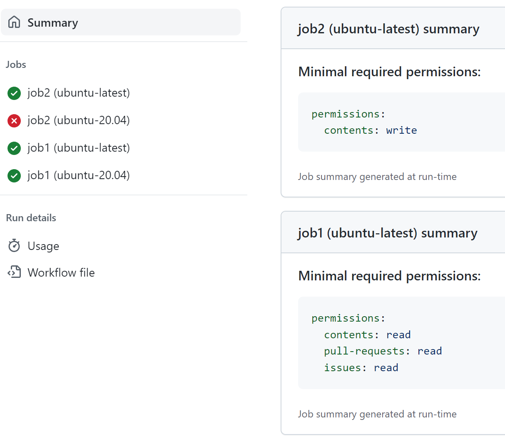

# GitHub token permissions usage Monitor and Advisor actions (PUBLIC BETA)

Applying the least privilege permissions to a GitHub Actions workflow is a best security practice, but can be challenging as it may break existing workflows.

The Monitor action, when added to a workflow, tracks the usage of the temporary GitHub repository token and gives recommendations on the minimum permissions required to run the workflow based on the actual detected workflow activity. Every workflow run generates a summary report with the recommendations. Since some steps or jobs may be skipped based on various conditions, the Advisor action can aggregate and summarize the recommendations from multiple workflow runs.

The typical scenario is to include the Monitor action in every job of the workflow that doesn't specify permissions explicitly, collect the recommendations from several workflow runs, apply the recommended minimal permissions, and then remove the Monitor action.

## Usage

[See the Monitor action](monitor)

[See the Advisor action](advisor)
