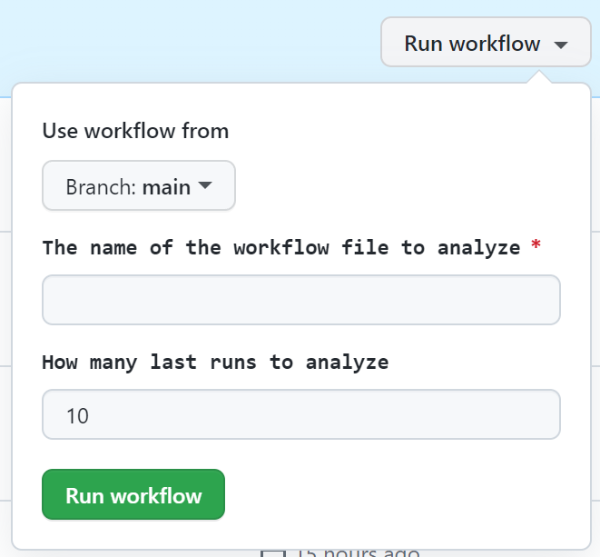

# GitHub token permissions Advisor action (PUBLIC BETA)

## Usage

The index.js script can be invoked as:

* GitHub action.

  See [workflow.yml](workflow.yml) for an example of how to use the Advisor action. Copy the workflow to your repository and manually dispatch the workflow from the Actions tab to generate the aggregated report from the last `n` runs.

  

* Command line tool.

  Download the [dist/index.js](dist/index.js) script and run it as:

  ```bash
  node index.js <workflow_name.yml> <number_of_the_last_runs> <github_owner> <repo_name> <branch_name>
  ```

  An environment variable `GITHUB_TOKEN` must be set to your [PAT](https://docs.github.com/en/authentication/keeping-your-account-and-data-secure/creating-a-personal-access-token) with `repo` scope granted for the repository you want to analyze.
