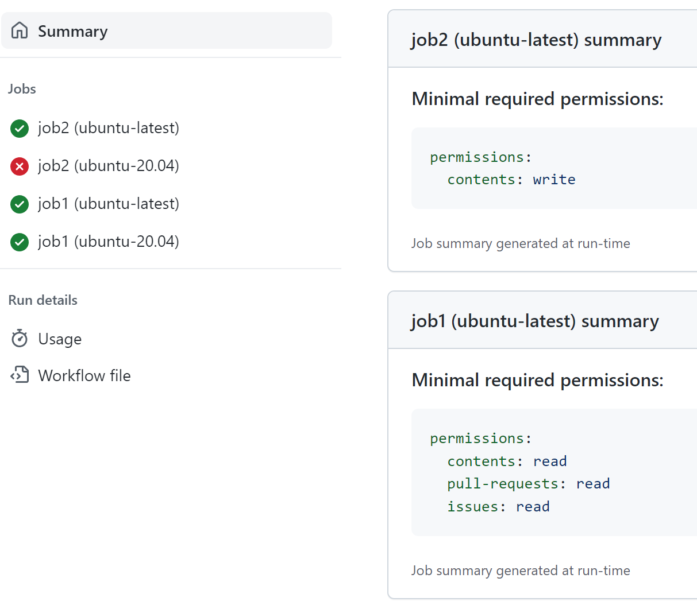

# GitHub token permissions Monitor action (PUBLIC BETA)

## Usage

Include the Monitor action in every job of your workflow. The actions should be the first step in the job, even before the checkout action.

```yaml
...
jobs:
  job1:
    runs-on: ubuntu-latest
    steps:
      - uses: GitHubSecurityLab/actions-permissions/monitor@v1
        with:
          config: ${{ vars.PERMISSIONS_CONFIG }}
...
  job2:
    runs-on: macos-latest
    steps:
      - uses: GitHubSecurityLab/actions-permissions/monitor@v1
        with:
          config: ${{ vars.PERMISSIONS_CONFIG }}

      - uses: actions/checkout@v3
...
```

The Monitor action generates a summary report in the repository Actions tab with the recommendations for each successfully completed job.



Additionally the reports for every job are saved as a workflow artifact for consumption later by the Advisor action. Each artifact is really small (less than 200 bytes), but if you don't plan to use the Advisor, you can prevent the creation of the artifacts by setting the `create_artifact` in the configuration to `false`.

## Configuration

The Monitor action accepts a `config` input parameter. The configuration is a JSON string with the following properties:

```json
{ "create_artifact": true, "enabled": true, "debug": false }
```

* `create_artifact` - if set to `false`, the Monitor action will not create a workflow artifact with the summary report. The default value is `true`.

* `enabled` - if set to `false`, the Monitor action will not monitor the usage of the GitHub token. The default value is `true`.

* `debug` - if set to `true`, the Monitor action will print additional debug information to the console. The default value is `false`. (Alternatively, debug logging can be enabled by restarting the runner with the debug checkbox marked or passing `debug` input parameter to the action.)

If the configuration is not provided, the default values are used, but it is recommended to provide a [variable](https://docs.github.com/en/actions/learn-github-actions/variables#defining-configuration-variables-for-multiple-workflows) explicitly even if doesn't exist yet. This will make it easier to provide the configuration later without changing the workflows:

```yaml
      - uses: GitHubSecurityLab/actions-permissions/monitor@v1
        with:
          config: ${{ vars.PERMISSIONS_CONFIG }}
```

## Known limitations

The Monitor action is not able to detect the usage of the GitHub token in the following cases:

* WindowsOS runners are not supported (yet, pull-requests are welcome if you know how to redirect all OS outgoing request through a transparent proxy, but not the outgoing proxy traffic itself).

* GitHub GraphQL API usage is not monitored. It would requires parsing and understanding the GraphQL queries. Pull-requests are welcome.

* The `discussions` permission type is not supported yet. AFAIK it is GraphQL only.

* Since the monitor is client based (runs on the Actions runner) it can't detect the usage of the GitHub token if it is passed to a third party web service, which calls the GitHub API back while the Action is running.
